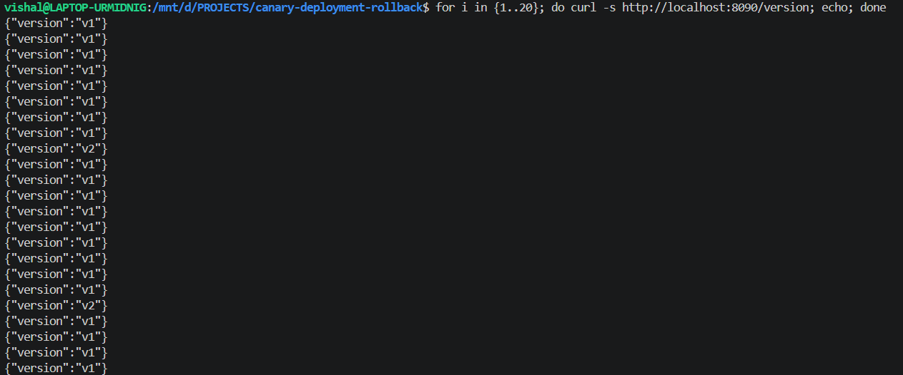
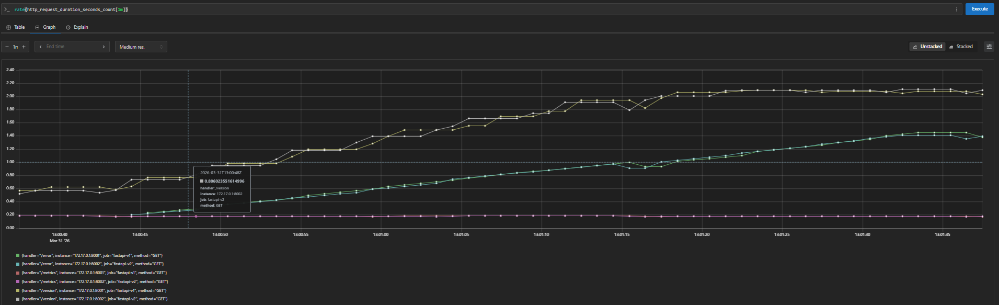
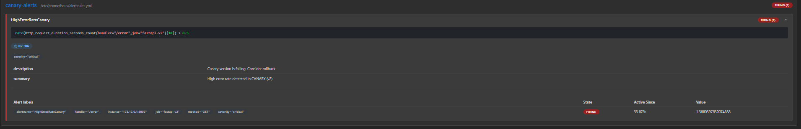
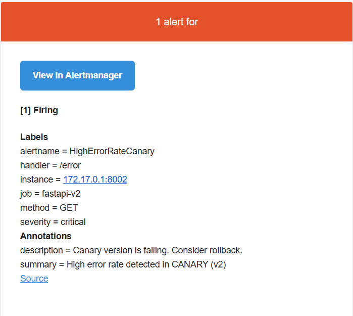
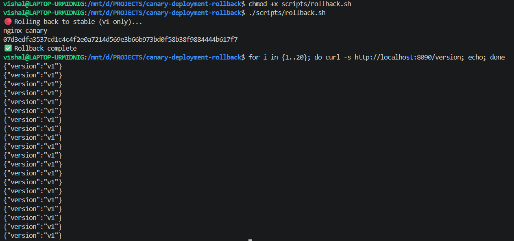

# Production-Ready Canary Deployment with Observability & Rollback Strategy
Traffic-based canary deployment with real-time monitoring, alerting, and controlled rollback mechanism
---
##  Problem Statement
Modern application deployments require safe release strategies to minimize risk, but traditional deployments often:

- Expose all users to unstable versions  
- Lack gradual rollout mechanisms  
- Delay detection of failures  
- Provide no controlled rollback process  

This increases the risk of production outages and poor user experience.
---
## 💡 Solution
This project implements a **Canary Deployment strategy** with observability and rollback control:

- Gradually routes traffic between stable (v1) and canary (v2) versions  
- Uses NGINX for traffic splitting (90/10)  
- Monitors application behavior using Prometheus  
- Triggers alerts when canary version fails  
- Enables manual rollback based on real-time system feedback  
---
## 📈 Impact
- Reduced deployment risk by exposing new version to limited users  
- Enabled early failure detection using real-time monitoring  
- Prevented full system outage through controlled rollback  
- Improved deployment confidence using traffic-based release strategy  

---
## 🏗️ Architecture

```
User → NGINX (Load Balancer)
        ↓
   ┌───────────────┬
   │               │
Stable (v1)     Canary (v2)
90% traffic     10% traffic

        ↓
Prometheus (metrics collection)
        ↓
Alertmanager (email alerts)
        ↓
Engineer decision
        ↓
Manual Rollback Script
```

---

## ⚙️ Tech Stack

| Tool         | Purpose                            |
| ------------ | ---------------------------------- |
| FastAPI      | Backend services                   |
| Docker       | Containerization                   |
| NGINX        | Traffic splitting (canary routing) |
| Prometheus   | Metrics monitoring                 |
| Alertmanager | Email alerting                     |
| Bash         | Automation scripts                 |

---

## 🚀 Features

* ✅ Canary deployment (90/10 traffic split)
* ✅ Real-time metrics collection
* ✅ Error-based alerting system (v2 only)
* ✅ Email notifications for failures
* ✅ Manual rollback with engineer approval
* ✅ Simulated failure endpoints (`/error`, `/slow`)

---

## 📂 Project Structure

```
canary-devops/
├── app/
│   ├── v1/                  # Stable version
│   ├── v2/                  # Canary version
├── nginx/
│   └── nginx.conf
├── monitoring/
│   └── prometheus.yml
├── alerts/
│   ├── alert.rules.yml
│   └── alertmanager.yml
├── scripts/
│   └── rollback.sh
├── screenshots/
└── docker-compose.yml
```

---

## 🔥 How It Works

### 1. Traffic Splitting

NGINX distributes traffic:

* 90% → Stable (v1)
* 10% → Canary (v2)

---

### 2. Metrics Collection

Prometheus scrapes:

* Request rate
* Error rate
* Latency

---

### 3. Alert Trigger

If **canary (v2)** error rate exceeds threshold:

* Alert is triggered

---

### 4. Notification

Alertmanager sends:
📩 Email alert to engineer

---

### 5. Manual Rollback

```bash
./scripts/rollback.sh
```

👉 Switches traffic to **100% stable (v1)**

---

## 🔁 Reliability & Failure Handling

- Canary version (v2) is exposed to limited traffic (10%)  
- Failures are detected using Prometheus metrics and alert rules  
- Alerts are triggered only for canary (v2), avoiding noise from stable version  
- Engineers validate system health before promoting or rolling back  
- Manual rollback ensures safe recovery without affecting all users  

---

## 📊 Key Prometheus Queries

### Request Rate

```
rate(http_request_duration_seconds_count[1m])
```

### Canary Error Rate

```
rate(http_request_duration_seconds_count{job="fastapi-v2", handler="/error"}[1m])
```

---

## 🧪 Testing

### Generate normal traffic

```
while true; do curl http://localhost:8090/; done
```

### Generate error traffic

```
while true; do curl http://localhost:8090/error; done
```

---

## 🔁 Rollback Verification

After running rollback:

```
v1
v1
v1
v1
```

👉 Confirms **100% traffic routed to stable version**

---

## 📸 Screenshots

### 🔀 Canary Traffic Splitting (90/10)

Traffic is routed between stable (v1) and canary (v2):



---

### 📊 Prometheus Monitoring

Real-time request rate and metrics visualization:



---

### 🚨 Alert Trigger (Canary Failure)

Alert is triggered ONLY when canary (v2) fails:



---

### 📩 Email Notification

Engineer receives alert via email:



---

### 🔁 Manual Rollback

After rollback, all traffic is routed to stable version:



---

## 🧠 Key Learnings

* Traffic-based deployment strategies (Canary release)
* Observability using Prometheus
* Alert-driven incident detection
* Importance of scoped alerting (targeting only canary)
* Human-in-the-loop rollback design

---

## 🎯 Real-World Relevance

This project simulates:

* Canary deployments used in Kubernetes / cloud platforms
* SRE monitoring and alerting practices
* Incident response workflows
* Controlled rollback strategies in production systems

---

## 🔮 Future Improvements

* Canary promotion (v2 → 100%)
* CI/CD pipeline integration
* Slack / webhook alerts
* Grafana dashboards for visualization
* Kubernetes + Service Mesh (Istio) implementation

---

## 🧠 Note

For testing purposes, traffic was temporarily increased to **50/50**
to quickly trigger alerts and validate monitoring behavior.


